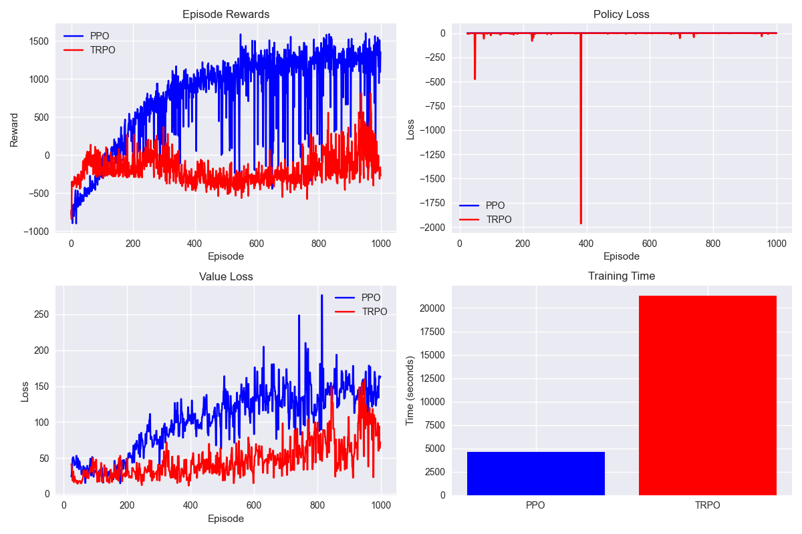

## 作业描述

- 详细学习策略梯度算法  
- 在问题1和问题2上实现一系列策略梯度算法  
  - 问题1：点迷宫导航（连续状态-动作空间，\( s, a \in \mathbb{R}^2 \)，状态范围 \( s \in [-0.5, 0.5]^2 \)，动作范围 \( a \in [-0.1, 0.1]^2 \)）  
  - 问题2：MuJoCo HalfCheetah，使机器人向前奔跑  
  - 必须使用普通策略梯度（Vanilla Policy Gradient）和自然策略梯度（Natural Policy Gradient），鼓励使用信赖域策略优化（TRPO）和近端策略优化（PPO）  

- 撰写报告介绍算法及实验过程  
  - 包括算法解释、实现步骤、评估结果、可视化图表等  
  - 将代码和报告提交至 *lizhang@smail.nju.edu.cn*  

---

## 作业1

可以注意到，当前策略已经基本收敛；并且智能体也能很好地完成点迷宫导航效果
1.对于奖励函数的设置如下：1.终点给予较大奖励 2.碰撞给予负奖励并done 3.终点附近给予正奖励鼓励前往终点，并且使得曲线更平滑
2.但是奖励函数的设置非常需要对于该任务的理解，因而仍需调整

---

## 作业2

可以注意到，当前策略仍还存在一定的震荡，可能是因为半人马智能体存在较为复杂的逻辑；目前只考虑了前进奖励和动作惩罚，并没有考虑翻滚等情况，后期会加入
当前策略已经基本实现半人马向前运动的效果

---
**陈容贤（南京大学**  
**高级策略梯度**  
**2025年4月7日**  
**详见** ：https://github.com/crx16888/RL_Homework 